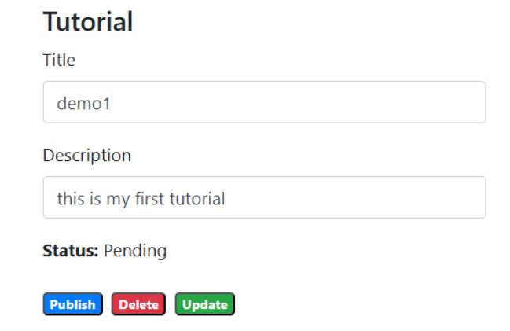

# MEAN App CI/CD Deployment on EC2 using Docker and GitHub Actions

This project demonstrates a **containerization** and **CI/CD pipeline** for a MEAN stack application (MongoDB, Express, Angular, Node.js) deployed on an AWS EC2 instance using Docker and GitHub Actions.

## Containerization & Deployment

1. **Create Dockerfiles** for both the frontend and backend.
2. **Build and push Docker images** to your Docker Hub account:

## Backend

```
docker build -t <your-dockerhub-username>/backend:latest ./backend
docker push <your-dockerhub-username>/backend:latest
```

## Frontend

```

docker build -t <your-dockerhub-username>/frontend:latest ./frontend
docker push <your-dockerhub-username>/frontend:latest
```

## EC2 Setup

Launch an Ubuntu EC2 instance.


## Install Docker and Docker Compose:

```
sudo apt update
sudo apt install docker.io docker-compose -y
sudo systemctl enable docker
sudo systemctl start docker

```

## Add your user to the Docker group:
```

sudo usermod -aG docker ubuntu

```
Move your app folder to the home directory and fix ownership:
```

sudo mv /root/mean-app /home/ubuntu/
sudo chown -R ubuntu:ubuntu /home/ubuntu/mean-app

```
## Deploy the app using Docker Compose:

```
cd ~/mean-app
docker-compose pull
docker-compose down
docker-compose up -d
```





